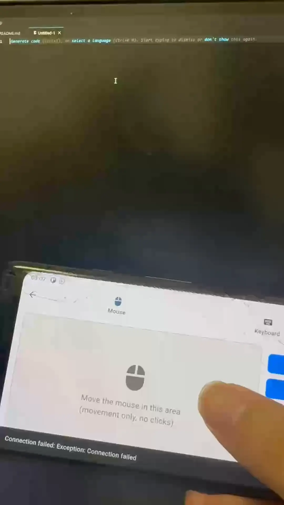
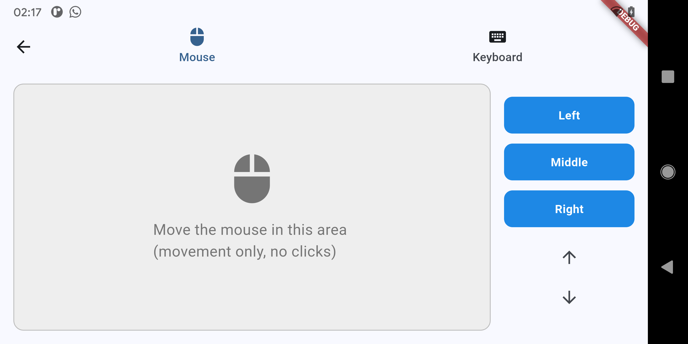
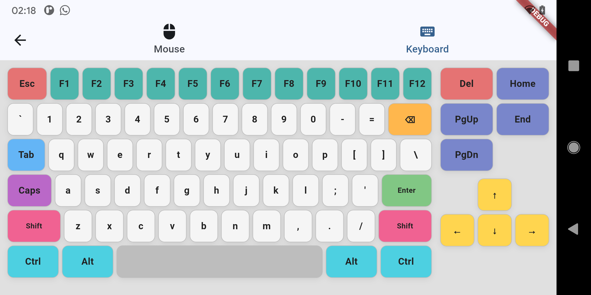
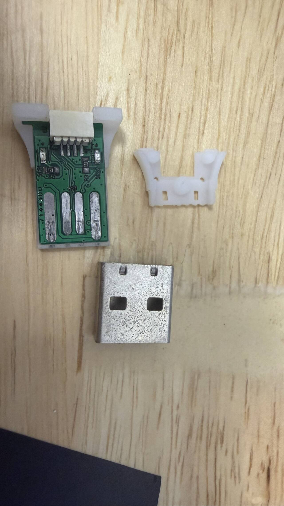
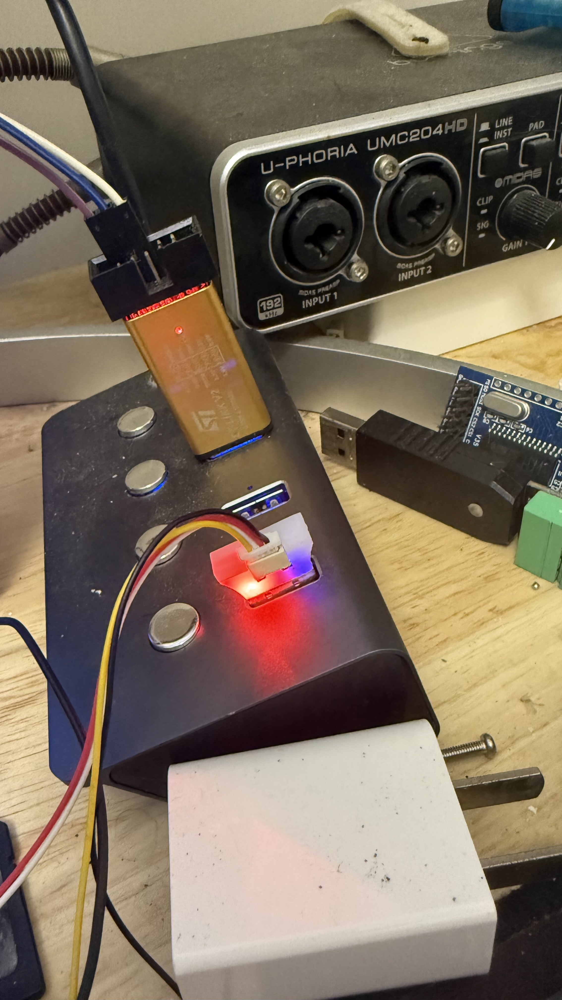

# ApexNub-Adapter

**ApexNub-Adapter** is a small USB HID hardware adapter that lets you control a connected host device from a companion app.

The idea is simple: send commands from the app, pass them through BLE, translate them into USB mouse and keyboard input, and control another device without plugging in a full keyboard or mouse.

This can be useful for bare-metal computers, embedded systems, tablets, development boards, mini PCs, or any setup where carrying extra peripherals is inconvenient.

The current prototype is focused on **mouse and keyboard control**. It already works, but latency can still be noticeable in some situations. This project is still early, and feedback, ideas, testing, and contributions are very welcome.

---

## Why I Built This

Sometimes you need to control a device, but you do not want to carry a keyboard, mouse, hub, and cables everywhere.

ApexNub-Adapter is my attempt to make a small, portable HID bridge that can turn a phone or companion device into a flexible input controller for another host.

It is not meant to fully replace a normal keyboard or mouse. Instead, it is designed to be a handy side tool for developers, makers, hardware testing, embedded systems, and compact workspaces.

---

## Demo

### Phone App to USB HID Control



ApexNub-Adapter receives commands from the companion app over BLE and translates them into USB HID mouse / keyboard input on the connected host.

---

## Current Features

* USB HID mouse control
* USB HID keyboard control
* BLE communication with companion app
* Flutter-based cross-platform app
* Nordic nRF52 firmware
* Custom PCB hardware design
* Open hardware, firmware, and software project structure

---

## Current Limitations

This is still an early prototype, so there are things that need improvement:

* Latency can still be noticeable in some use cases
* HID support is currently focused on mouse and keyboard
* The firmware and app are still experimental
* More testing is needed across different host devices
* UI and workflow can still be improved

Contributions, suggestions, bug reports, and real-world testing are very helpful.

---

## Gallery

### App Screenshots

| Mouse Page                                       | Keyboard Page                                          |
| ------------------------------------------------ | ------------------------------------------------------ |
|  |  |

### Hardware Photos

| Assembled Hardware                                         | Hardware Detail                               |
| ---------------------------------------------------------- | --------------------------------------------- |
|  |  |


---

## Repository Layout

This repository contains the complete ApexNub-Adapter project, including the app, firmware, and hardware design files.

---

## App

Path:

```text
App/apex_nub_adapter/
```

This folder contains the Flutter companion app for ApexNub-Adapter.

The app includes BLE-related dependencies, a local `nrf_ble_dfu` package, and platform folders for:

* Android
* iOS
* Linux
* macOS
* Web
* Windows

Key files:

```text
App/apex_nub_adapter/pubspec.yaml
App/apex_nub_adapter/lib/main.dart
App/apex_nub_adapter/lib/pages/
App/apex_nub_adapter/lib/services/
```

---

## Firmware

Path:

```text
Firmware/ApexNub-Adapter/
```

This folder contains the Keil uVision firmware project for the adapter hardware.

The firmware targets Nordic nRF52 hardware and expects a local copy of Nordic `nRF5_SDK_17.1.0` at:

```text
Firmware/ApexNub-Adapter/nRF5_SDK_17.1.0/
```

The Nordic SDK is not included in this repository, so you will need to provide your own copy before building the firmware.

Key files:

```text
Firmware/ApexNub-Adapter/apexnub-adapter.uvprojx
Firmware/ApexNub-Adapter/apexnub-adapter.uvoptx
Firmware/ApexNub-Adapter/Inc/
```

---

## Hardware

Path:

```text
Hardware/ApexNub-Adapter/
```

This folder contains the Altium Designer project for the ApexNub-Adapter PCB.

Key files:

```text
Hardware/ApexNub-Adapter/ApexNub-Adapter.PrjPcb
Hardware/ApexNub-Adapter/adapter-core.SchDoc
Hardware/ApexNub-Adapter/nrf52833-core.SchDoc
Hardware/ApexNub-Adapter/adapter.PcbDoc
```

---

## Getting Started

### Flutter App

1. Install Flutter.
2. Open the app folder:

```text
App/apex_nub_adapter
```

3. Install dependencies:

```bash
flutter pub get
```

4. Run the app on your target platform:

```bash
flutter run
```

---

### Firmware

1. Download or prepare your own copy of Nordic `nRF5_SDK_17.1.0`.

2. Place it here:

```text
Firmware/ApexNub-Adapter/nRF5_SDK_17.1.0/
```

3. Open the Keil uVision project:

```text
Firmware/ApexNub-Adapter/apexnub-adapter.uvprojx
```

4. Confirm your compiler, target, and debug probe settings.

5. Build and flash the firmware from Keil.

---

### Hardware

1. Open the Altium Designer project:

```text
Hardware/ApexNub-Adapter/ApexNub-Adapter.PrjPcb
```

2. Review the schematic, PCB layout, and generated outputs.

3. Feel free to study, modify, or improve the design.

---

## How You Can Help

This project is still young, and there are many areas where help would be valuable.

You can participate by:

* Testing the adapter on different host devices
* Improving BLE latency and reliability
* Improving the Flutter app UI and control flow
* Adding more HID profiles
* Reviewing the PCB design
* Suggesting better hardware layouts
* Reporting bugs or compatibility issues
* Sharing ideas for real-world use cases

Even simple feedback is useful. If you try the project, I would love to hear what worked, what felt awkward, and what could be better.

---

## Possible Future Improvements

Some ideas I may explore later:

* Lower-latency BLE communication
* More stable reconnect behavior
* Better mouse movement smoothing
* Gamepad HID support
* More customizable button and macro mapping
* Easier firmware update flow
* Smaller PCB revision
* Case/enclosure improvements
* Better documentation and setup guide

---

## Join the Community

If you are interested in small input devices, embedded hardware, HID tools, or maker-focused control devices, feel free to join the community.

* Reddit: https://www.reddit.com/r/apexnub/
* Discord: https://discord.gg/GVWKh4HV3E

Questions, suggestions, bug reports, and collaboration ideas are all welcome.

---

## My Other Project: ApexNub

I am also working on **ApexNub**, my current Kickstarter project.

ApexNub is a **multi-function pocket-sized controller** designed for makers, developers, and hardware projects.

It is built around the idea of giving users a customizable control device that can adapt to different workflows, devices, and input needs.

Check it out here:

https://apexnub.com

---

## Notes

* A root `.gitignore` is included for generated files from Flutter, Keil, SEGGER/J-Link, Altium, `.github` folders, and the local Nordic SDK directory.
* The Nordic SDK is not stored in Git.
* To compile the firmware, provide your own copy at:

```text
Firmware/ApexNub-Adapter/nRF5_SDK_17.1.0/
```

* Platform-specific and package-specific ignore files under the Flutter app remain in place.

---

## Status

ApexNub-Adapter is currently an early working prototype.

It is functional, but not polished yet. The goal is to keep improving it into a small, practical, and open tool for everyday hardware control, development, and experimentation.

Feedback and contributions are welcome.

## License

This project, including software, firmware, and hardware design files, is licensed under the GNU General Public License v3.0.

You are free to use, study, modify, and distribute this project under the terms of the GPL-3.0 license.

See the [LICENSE](LICENSE) file for more details.